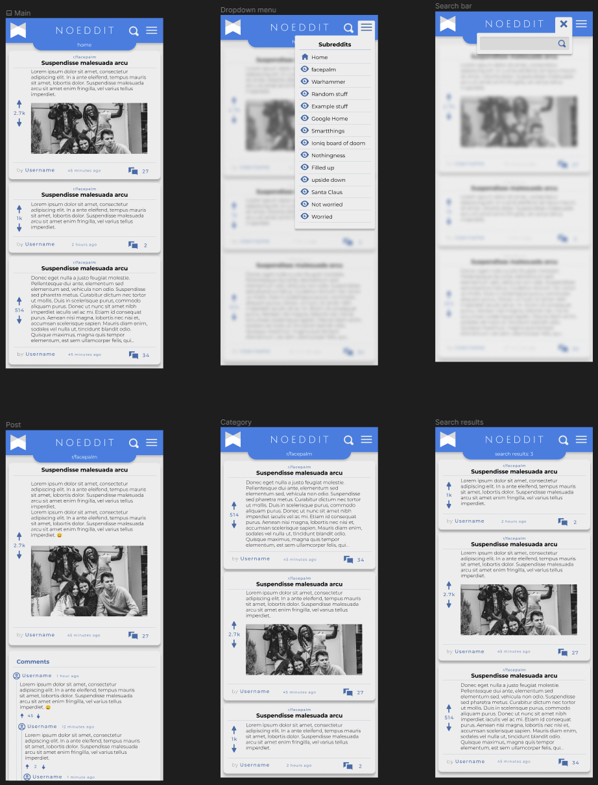
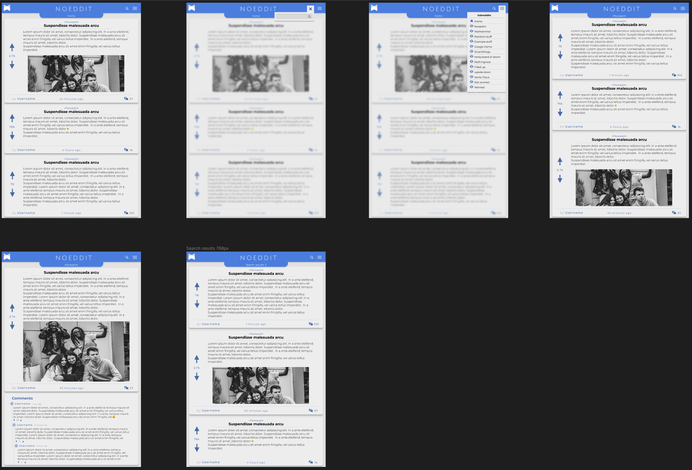
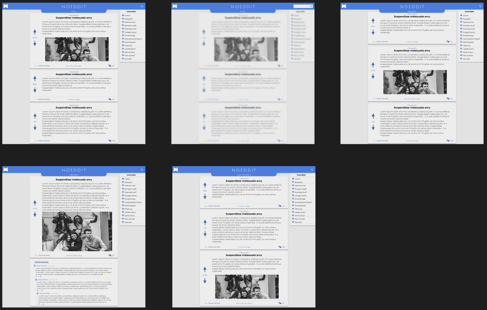
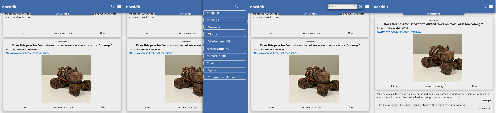
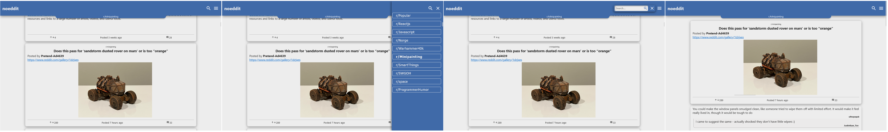
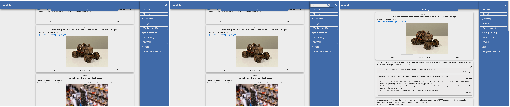

# noeddit

Live version: [noeddit.netlify.app](https://noeddit.netlify.app/)

A lite version of Reddit. This project was created to enhance my knowledge of API's, React, Redux Toolkit, React Router v6 and multiple other technologies.
Portfolio project through Codecademy.

## Tech stack

- React
  - Redux Toolkit
  - React Router v6
- HTML5
- CSS3
- Javascript
- Jest & RTL
- Git
- NPM
- API (Reddit API)
- VS Code

## Features

- Lite view of posts from subreddits.
- View posts with votes and comments.
  - View markdown parsed as rich text in the app.
  - Time elapsed since posting.
  - Support for listing comments three tiers down.
- Subreddit selection.
- Search function.
- Infinite scroll.
- Cache for posts and comments.
- Scroll restoration.
- Compatible with all modern devices.

## Testing

- Ongoing

## Known bugs and fixes

- No known

## Future features

- [ ] Split app in smaller parts and refactor code for better SoC
- [x] Add infinite scroll
- [x] Add search functionality
- [x] Optimize caching in localStorage
- [x] Add MarkDown-translator for emojis, rich text and so on.

# Wireframes

### Mobile

#### Desktop 768px

#### Desktop 1200px

# Screenshots of end product

#### Mobile

#### Desktop 768px

#### Desktop 1200px

#### Desktop 1600px

